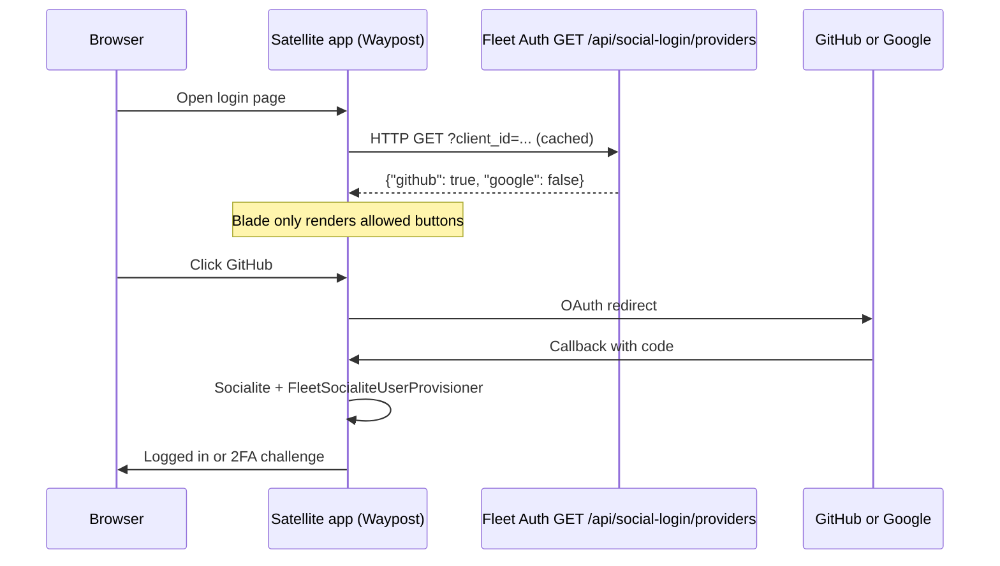

# Fleet Social Login (GitHub / Google)

This describes how **GitHub** and **Google** sign-in work on **satellite apps** (Waypost, Fleet Console, etc.) while **Fleet Auth** stores **per Passport client** flags for which providers may appear.

## Why two layers?

1. **Fleet Auth policy (per app)** — Each **OAuth client** (same UUID as the satellite’s **`FLEET_IDP_CLIENT_ID`**) has **`social_github_enabled`** / **`social_google_enabled`**. Satellites call the public JSON API with **`?client_id=`** and cache the response.
2. **Per-app Socialite credentials** — Each satellite still configures GitHub/Google in `config/services.php` (and redirect URIs with GitHub/Google). The IdP does not store those secrets.

If either layer says “no,” the user does not see that button (or gets 404 on the redirect URL).

## End-to-end flow



## Fleet Auth (operator)

### Admin UI

- **Path:** Admin → **Integrations** → under each **OAuth client** block, **Third-party sign-in (GitHub / Google)** — save updates that Passport client only.
- **Also:** Admin → **Edit OAuth client** — same toggles on the main edit form.
- **Route:** `POST /admin/oauth-clients/{oauth_client}/social-login` (name: `admin.oauth-clients.social-login.update`), behind admin auth and **password confirmation** (same as other sensitive OAuth actions).
- Changes are audited (`oauth_client.social_login_updated`).

### Public API (no auth)

- **URL:** `{FLEET_AUTH_URL}/api/social-login/providers?client_id={uuid}`
- **Method:** `GET`
- **`client_id`:** Must be the satellite’s **authorization-code** Passport client id (same value as **`FLEET_IDP_CLIENT_ID`** in the app). Unknown or **revoked** clients → **404** JSON. Malformed UUID → **422**.
- **Without `client_id`:** Response uses **`fleet_auth.social_login.*`** env defaults only (no `oauth_clients` row read). Useful for diagnostics, not normal satellite operation.

**Response:**

```json
{ "github": true, "google": true }
```

### Environment variables (Fleet Auth)

| Variable | Role |
|----------|------|
| `FLEET_AUTH_SOCIAL_GITHUB` | Default GitHub flag when **`?client_id=`** is omitted |
| `FLEET_AUTH_SOCIAL_GOOGLE` | Default Google flag when **`?client_id=`** is omitted |

### Database

- Columns on **`oauth_clients`:** `social_github_enabled`, `social_google_enabled` (boolean, default true).
- Migration: `2026_04_07_000001_social_login_per_oauth_client.php` (migrates from legacy **`social_login_settings`** if present, then drops that table).
- Feature tests: `tests/Feature/SocialLoginProvidersTest.php`

### Cache note

Client apps **cache** the policy response for a short TTL (default 60s). After toggling in admin, expect up to one TTL before all satellites pick up the change. For a quicker effect, lower `FLEET_IDP_SOCIALITE_POLICY_CACHE` on clients or add a future “purge” hook.

---

## Satellite app (`shaferllc/fleet-idp-client`)

### Composer

Require **`shaferllc/fleet-idp-client`** `^0.9` (or newer). The package pulls in **Laravel Socialite**.

### Fleet Auth URL

Set **`FLEET_IDP_URL`** and **`FLEET_IDP_CLIENT_ID`** (authorization-code client UUID). The package requests:

`{FLEET_IDP_URL}/api/social-login/providers?client_id={FLEET_IDP_CLIENT_ID}`

unless **`FLEET_IDP_SOCIALITE_PROVIDERS_URL`** overrides the full URL (then **`client_id`** is still appended if not already present).

### Routes (when Socialite is enabled)

Registered by the package under prefix **`oauth`** by default:

| Method | Path | Route name |
|--------|------|------------|
| GET | `/oauth/github` | `fleet-idp.socialite.redirect` |
| GET | `/oauth/github/callback` | `fleet-idp.socialite.callback` |
| GET | `/oauth/google` | same pattern |

`{provider}` is restricted to `github` and `google`.

### Blade component

Use the namespaced component on login/register views:

```blade
<x-fleet-idp::social-login-buttons variant="waypost" />
```

- **`variant`:** `waypost` or `console` (styling).
- The component shows **Fleet IdP** (email OAuth) when configured, plus **GitHub/Google** only when:
  - Policy allows the provider, and
  - `config('services.github')` / `config('services.google')` have the expected client id + secret.

Call `SocialLoginButtons::isEnabled()` from PHP if you need to show a “or continue with” divider only when something is visible.

### `config/services.php`

Configure Socialite as Laravel docs describe, for example:

- `GITHUB_CLIENT_ID`, `GITHUB_CLIENT_SECRET`, `GITHUB_REDIRECT_URI` → `services.github`
- `GOOGLE_CLIENT_ID`, `GOOGLE_CLIENT_SECRET`, `GOOGLE_REDIRECT_URI` → `services.google`

Redirect URIs must match the satellite’s **`/oauth/{provider}/callback`** URLs (scheme + host + path).

### Important env vars (satellite)

| Variable | Typical purpose |
|----------|-----------------|
| `FLEET_IDP_URL` | Fleet Auth base URL; drives policy fetch |
| `FLEET_IDP_CLIENT_ID` | Sent as **`client_id`** on the providers API (must match the Passport client you toggle in Fleet Auth) |
| `FLEET_IDP_SOCIALITE_ENABLED` | `false` disables Socialite routes entirely |
| `FLEET_IDP_SOCIALITE_PROVIDERS_URL` | Override full URL for the providers JSON (rare) |
| `FLEET_IDP_SOCIALITE_POLICY_CACHE` | Cache TTL in seconds (default 60) |
| `FLEET_IDP_SOCIALITE_POLICY_TIMEOUT` | HTTP timeout for policy request (seconds) |
| `FLEET_IDP_SOCIALITE_POLICY_FAIL_OPEN` | If `true` (default), unreachable IdP still allows buttons if `services.*` is set; if `false`, buttons hide when IdP cannot be reached |
| `FLEET_IDP_SOCIALITE_NULL_PASSWORD` | Whether new social users get a null password locally |
| `FLEET_IDP_SOCIALITE_ERROR_ROUTE` | Where to redirect on Socialite errors (default `login`) |
| `FLEET_IDP_SOCIALITE_POST_LOGIN_ROUTE` | After successful login |
| `FLEET_IDP_SOCIALITE_TWO_FACTOR_*` | Session keys / route for 2FA compatibility |

Full list and defaults: `fleet-idp-client/config/fleet_idp.php` → `socialite`.

### Code map (package)

| Piece | Role |
|-------|------|
| `routes/socialite.php` | Registers `/oauth/{provider}` routes |
| `FleetSocialLoginPolicy` | GET + cache providers JSON |
| `SocialiteOAuthController` | Redirect + callback, 404 if disallowed |
| `FleetSocialiteUserProvisioner` | Link or create local user from Socialite user |
| `View/Components/SocialLoginButtons` | UI entry points |

---

## Waypost reference

Waypost removed its app-local `OAuthController` / `oauth-providers` component in favor of **`x-fleet-idp::social-login-buttons`**. See:

- `resources/views/livewire/pages/auth/login.blade.php`
- `resources/views/livewire/pages/auth/register.blade.php`
- `routes/auth.php` (no local Socialite routes)

---

## Troubleshooting

| Symptom | Things to check |
|---------|------------------|
| Button missing | Policy JSON for **this** `client_id`; `FLEET_IDP_CLIENT_ID` matches the web OAuth client; `services.github` / `services.google`; `FLEET_IDP_SOCIALITE_ENABLED` |
| 404 on `/oauth/github` | Provider not in policy, or Socialite disabled, or invalid provider slug |
| Stale on/off after admin change | Policy cache TTL on satellite; wait or lower `FLEET_IDP_SOCIALITE_POLICY_CACHE` |
| Redirect URI mismatch | GitHub/Google app settings vs satellite `APP_URL` + `/oauth/.../callback` |
| Works without `FLEET_IDP_URL` | Fail-open + local `services.*` only; set `FLEET_IDP_SOCIALITE_POLICY_FAIL_OPEN=false` to require IdP |

---

## Related reading

- [shaferllc/fleet-idp-client README](https://github.com/shaferllc/fleet-idp-client/blob/main/README.md) — installation, CLI configure, Socialite summary
- [Wiki home](Home)
- [Publishing views and styling](Publishing-views-and-styling) — theme Socialite buttons and OAuth failure page with the rest of auth
- [Configuration reference](Configuration-reference) — `FLEET_IDP_SOCIALITE_*` and related env
- [Troubleshooting](Troubleshooting) — consolidated auth issues
